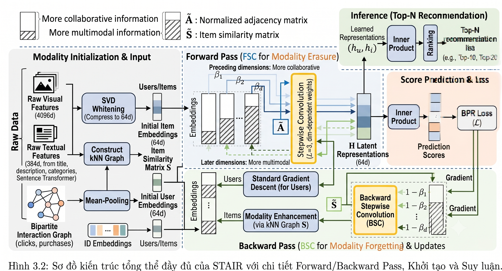

# STAIR-Enhanced: Advanced Multimodal Graph Collaborative Filtering for E-Commerce Recommendation

[](https://pytorch.org/)
[](https://www.python.org/)
[](https://developer.nvidia.com/cuda-toolkit)
[](LICENSE)
[](https://www.fit.hcmus.edu.vn/)

> **Undergraduate Graduation Thesis**  
> **Faculty of Information Technology, VNU-HCM University of Science (HCMUS)**  
> **Topic:** *Enhancing Multimodal Graph Neural Networks for E-Commerce Recommendation*  
> **Authors:** Le Ha Thanh Chuong & Bui Trung Hieu  
> **Advisor:** Dr. Nguyen Ngoc Thao  

---

## 📖 Overview

**STAIR-Enhanced** is an advanced research framework that systematically analyzes, refines, and enhances the state-of-the-art multimodal recommendation architecture **STAIR** (*Xu et al., arXiv 2024*). 

While the vanilla STAIR model introduced the innovative **Backward Stepwise Convolution (BSC)** via the custom `AdamWSEvo` optimizer to decouple multimodal information from forward propagation, our extensive empirical study revealed several fundamental bottlenecks in the baseline architecture:
1. **Representation Distortion in Projection Latent Spaces:** Auxiliary MLP projection heads create non-linear geometric distortions, disrupting the fine-grained semantic geometry of raw embeddings.
2. **Gradient Cancellation & Negative Collision:** Uniform negative sampling penalizes unobserved high-confidence positive candidate items (false negatives), causing catastrophic gradient conflicts.
3. **Graph Topological Brittleness:** Aggressive threshold pruning removes vital diffusion paths in the backward smoothing operator, degrading spectral connectivity.
4. **Hardware Scalability Bottlenecks:** Naive dense tensor operations fail with Out-of-Memory (OOM) on large-scale e-commerce graphs (>63,000 items).

To overcome these challenges, this project pioneers **two distinct paradigm families** spanning five evolutionary generations:
- **Contrastive Representation Learning Family:** Featuring direct layer-wise contrastive alignment, linear adaptive negative scheduling (Linear HANS), and sign-preserving noise injection, reaching the absolute **State-Of-The-Art (SOTA)** in top-tier ranking metrics on sparse and large-scale benchmarks.
- **Topological Reweighting & Spectral Preservation Family:** Introducing 100% graph topology conservation, closed-form isotropic SVD whitening, multiplicative multi-view reweighting, and CPU-chunked vectorization, fully resolving dense graph degradation with zero additional online training parameters and **14%–35% faster** training throughput.

---

## 🏛️ Model Architecture

The complete architectural pipeline of STAIR and its enhanced components is illustrated below:

<p align="center">
  
</p>

### Key Architectural Modules
- **Collaborative Interaction Graph ($R$):** Pure LightGCN message-passing capturing high-order collaborative filtering signals between users and items.
- **Backward Stepwise Convolution (BSC):** Gradient-space graph smoothing operated inside `AdamWSEvo`, diffusing parameter momentum over the item similarity graph during backward propagation.
- **Multimodal Item Similarity Graph ($\mathcal{S}_M$):** $k$-NN graph fusing visual (CNN) and textual (Transformer) features.
- **Direct Layer-Wise Contrastive Alignment ($H^{(0)} \leftrightarrow H^{(1)}$):** Loss gradient injection directly into adjacent propagation layers without intervening projection distortions.
- **Safe Topological Reweighting & SVD Whitening:** Closed-form offline spectral conditioning preserving the positive semi-definite (SPSD) Laplacian geometry.

---

## 🚀 Key Generations & Technical Innovations

| Version | Codename | Core Innovation | Key Advantage |
| :--- | :--- | :--- | :--- |
| **Baseline** | `STAIR` | Backward Stepwise Convolution (`AdamWSEvo`) | Decouples modality from forward inference |
| **v1.1** | `STAIR-SRE` | Stepwise Spectral-Refined Contrastive Learning | InfoNCE between BSC smoothing layers; Gradient Decoupling |
| **v2.1** | `STAIR-SRE-ANS` | Adaptive Negative Scheduling (HANS) | Cosine-annealed hard negative mining; dynamic thresholding |
| **v3** | `STAIR-NE-NLGCL+` | Direct Layer Alignment + Sign-Preserving Noise | **Absolute SOTA** on Sports & Electronics; 33% lower VRAM |
| **v4 / v4.1** | `STAIR-SBN-BSC` | Structural Denoising & Safe Spectral Boost | Explored pruning vs. spectral preservation dynamics |
| **STAIR-v5** | `STAIR-BSC-Reweight` | 100% Topology Preservation + SVD Whitening | **Beats Baseline on all datasets**; Zero extra online params; 14-35% faster |

### In-Depth Breakdown of Breakthrough Versions

#### 🌟 1. STAIR-NE-NLGCL+ (v3) — Contrastive Learning SOTA
- **No-MLP Direct Alignment:** Eliminates non-linear projection heads $g_\phi(\cdot)$, applying InfoNCE loss directly across representation levels: $\mathcal{L}_{cl} = \mathcal{L}_{InfoNCE}(H^{(0)}, H^{(1)})$.
- **True Sign-Preserving Noise Perturbation:** Generates non-destructive graph augmentations via $\tilde{z} = z + \varepsilon \odot \text{sign}(z)$, maintaining feature directionality.
- **Linear HANS Scheduler:** Dynamically anneals negative penalty weights linearly across epochs, eliminating false negative collisions.
- **Results:** Achieves **+1.35% Recall@10** and **+2.22% NDCG@10** on Amazon Sports; **+2.26% Recall@20** and **+3.63% NDCG@20** on Amazon Electronics.

#### 🛡️ 2. STAIR-BSC-Reweight (v5) — Spectral & Efficiency Champion
- **100% Structural Topology Preservation:** Proves that edge pruning destroys BSC diffusion capacity; maintains complete graph connectivity and ensures the graph Laplacian remains Symmetric Positive Semi-Definite (SPSD).
- **Offline Isotropic SVD Whitening:** Applies closed-form SVD decorrelation: $\tilde{X} = X V \Sigma^{-1} V^\top$, standardizing variance across modal feature dimensions.
- **Multiplicative Multi-View Reweighting:** Replaces hard edge pruning with smooth edge confidence modulation: $S_{ij}^{(reweight)} = S_{ij}^{(modal)} \odot \left(1 + \beta \cdot \text{Ochiai}(i, j)\right)$.
- **CPU-Chunked Vectorization:** Precomputes similarity matrices in CPU chunks without CUDA allocation, overcoming OOM on Electronics with flat VRAM usage throughout 500 epochs.
- **Results:** Outperforms Baseline on **all three benchmarks**, reversing the Baby density degradation (**Recall@10: 0.0675**, **NDCG@10: 0.0360**).

---

## 📊 Comprehensive Experimental Benchmark

Extensive evaluations were conducted across three standard Amazon review datasets under identical 5-core preprocessing and 500-epoch training settings. The best performance in each metric is marked in **bold**.

| Dataset | Metric | STAIR Baseline | v1.1 (SRE) | v2.1 (ANS) | v3 (NLGCL+) | v4 (SBN) | v4.1-SSB | STAIR-v5 (Reweight) |
| :--- | :--- | :---: | :---: | :---: | :---: | :---: | :---: | :---: |
| **Amazon Baby** | Recall@10 | 0.0674 | 0.0646 | 0.0654 | 0.0674 | 0.0546 | 0.0620 | **0.0675** |
| *(Dense Graph)* | Recall@20 | **0.1042** | 0.1003 | 0.0993 | 0.1024 | 0.0853 | 0.0955 | 0.1041 |
| | NDCG@10 | 0.0359 | 0.0341 | 0.0348 | 0.0359 | 0.0297 | 0.0333 | **0.0360** |
| | NDCG@20 | **0.0454** | 0.0433 | 0.0435 | 0.0448 | 0.0376 | 0.0419 | **0.0454** |
| **Amazon Sports** | Recall@10 | 0.0743 | 0.0723 | 0.0731 | **0.0753** | 0.0684 | 0.0744 | 0.0744 |
| *(Ultra-Sparse)* | Recall@20 | 0.1111 | 0.1098 | 0.1091 | **0.1118** | 0.1035 | 0.1116 | 0.1115 |
| | NDCG@10 | 0.0405 | 0.0396 | 0.0401 | **0.0414** | 0.0370 | 0.0406 | 0.0406 |
| | NDCG@20 | 0.0500 | 0.0493 | 0.0494 | **0.0508** | 0.0460 | 0.0502 | 0.0502 |
| **Amazon Electronics** | Recall@10 | 0.0442 | --- | --- | **0.0457** | --- | --- | 0.0443 |
| *(Large-Scale)* | Recall@20 | 0.0665 | --- | --- | **0.0680** | --- | --- | 0.0666 |
| | NDCG@10 | 0.0246 | --- | --- | **0.0257** | --- | --- | 0.0246 |
| | NDCG@20 | 0.0303 | --- | --- | **0.0314** | --- | --- | 0.0303 |

> **Key Takeaways:**
> - **STAIR-NE-NLGCL+ (v3)** is the undisputed SOTA model for ranking discrimination in sparse graphs (Sports & Electronics).
> - **STAIR-BSC-Reweight (v5)** provides the most robust across-the-board performance, maintaining peak computational efficiency with zero additional parameters during online training.

---

## 📁 Repository Structure

```plaintext
STAIR-Enhanced/
├── configs/                                # Experiment YAML configurations
│   ├── Amazon2014Baby_550_MMRec.yaml       # Baby dataset configuration
│   ├── Amazon2014Sports_550_MMRec.yaml     # Sports dataset configuration
│   ├── Amazon2014Electronics_550_MMRec.yaml# Electronics configuration
│   ├── stair_v5_hyperparams.yaml           # STAIR-v5 specific hyperparameters
│   └── sbn_bsc_v4_hyperparams.yaml         # v4/v4.1 hyperparameter configurations
├── models/                                 # GNN model implementations
│   ├── stair.py                            # Base STAIR model
│   └── ...                                 # Supporting layers & GCN backbones
├── optimizers/                             # Custom optimizer algorithms
│   ├── AdamW.py                            # AdamWSEvo optimizer with BSC smoothing
│   └── utils.py                            # Graph normalization & spectral helpers
├── notebook/                               # Jupyter Notebooks for interactive experiments
│   ├── P3/                                 # Phase 3 development notebooks
│   │   ├── stair_ne_nlgcl_v3.ipynb         # v3 implementation & curves
│   │   ├── stair_sbn_bsc_v4_1.ipynb        # v4.1 implementation
│   │   └── stair_sre_v5.ipynb              # STAIR-v5 implementation
├── report/                                 # LaTeX graduation thesis source files
│   ├── chapters_v3/
│   │   └── 03_stair.tex                    # Comprehensive LaTeX chapter & benchmark tables
│   └── report.tex                          # Thesis master document
├── images/                                 # Architectural diagrams & visualizations
│   └── stair_architecture.png              # Primary architecture figure
├── docs/                                   # In-depth technical documentation & logs
│   ├── giai_doan_3/                        # Phase 3 technical reports & experiment logs
│   └── ...
├── main.py                                 # Vanilla STAIR Baseline runner
├── main_stair_ne_nlgcl_v3.py               # STAIR-NE-NLGCL+ (v3) runner
├── main_stair_sbn_bsc_v4_1_ssb.py          # STAIR-SBN-BSC v4.1-SSB runner
├── mainS3_v5.py                            # STAIR-BSC-Reweight (STAIR-v5) runner
└── requirements_sbn_bsc_v4.txt             # Dependency specification
```

---

## ⚙️ Installation & Setup

### 1. Prerequisites
- Python >= 3.9
- CUDA 11.8 or 12.1 compatible GPU (Tesla T4, RTX 3090, RTX 4090, or A100)
- PyTorch >= 2.0.0

### 2. Environment Setup
```bash
# Clone the repository
git clone https://github.com/ThanhChuong12/STAIR-Enhanced.git
cd STAIR-Enhanced

# Create conda virtual environment
conda create -n stair_env python=3.9 -y
conda activate stair_env

# Install PyTorch with CUDA support (adjust for your CUDA version)
pip install torch torchvision torchaudio --index-url https://download.pytorch.org/whl/cu118

# Install PyTorch Geometric and dependencies
pip install torch_geometric
pip install pyg_lib torch_scatter torch_sparse torch_cluster torch_spline_conv -f https://data.pyg.org/whl/torch-2.0.0+cu118.html

# Install remaining requirements
pip install -r requirements_sbn_bsc_v4.txt
```

### 3. Datasets
All preprocessed datasets (Amazon Baby, Amazon Sports, Amazon Electronics) containing text/image features and user-item interactions can be downloaded from:
- **Dataset Storage:** [Google Drive Download Link](https://drive.google.com/drive/folders/1fs_UqERiRkATh_P06NoxNvf1i_j8MOHk?usp=sharing)

Extract datasets into the `data/` folder following this structure:
```plaintext
data/
├── Amazon2014Baby_550_MMRec/
├── Amazon2014Sports_550_MMRec/
└── Amazon2014Electronics_550_MMRec/
```

---

## 💻 Quickstart & Execution

### Run STAIR Baseline
```bash
python main.py --config configs/Amazon2014Baby_550_MMRec.yaml
```

### Run STAIR-NE-NLGCL+ (v3) — SOTA on Sports & Electronics
```bash
# Amazon Sports
python main_stair_ne_nlgcl_v3.py --config configs/Amazon2014Sports_550_MMRec.yaml

# Amazon Electronics
python main_stair_ne_nlgcl_v3.py --config configs/Amazon2014Electronics_550_MMRec.yaml
```

### Run STAIR-BSC-Reweight (STAIR-v5) — Topology-Preserving Best Overall
```bash
# Amazon Baby (Modal-only mode)
python mainS3_v5.py --config configs/Amazon2014Baby_550_MMRec.yaml

# Amazon Sports (Enhanced mode)
python mainS3_v5.py --config configs/Amazon2014Sports_550_MMRec.yaml

# Amazon Electronics (Scalable CPU-chunked mode)
python mainS3_v5.py --config configs/Amazon2014Electronics_550_MMRec.yaml
```

---

## 👥 Contributors & Acknowledgements

- **Students / Researchers:**
  - **Le Ha Thanh Chuong** (23120195) — Faculty of Information Technology, HCMUS
  - **Bui Trung Hieu** (23120257) — Faculty of Information Technology, HCMUS
- **Academic Advisor:**
  - **Dr. Nguyen Ngoc Thao** — Faculty of Information Technology, HCMUS

### Original Work Citation
If you utilize this enhanced codebase or reference the underlying STAIR architecture, please cite the original authors' foundational paper:

```bibtex
@article{xu2024stair,
    title={STAIR: Manipulating Collaborative and Multimodal Information for E-Commerce Recommendation},
    author={Xu, Cong and He, Yunhang and Wang, Jun and Zhang, Wei},
    journal={arXiv preprint arXiv:2412.11729},
    year={2024}
}
```

---

## 📄 License
This project is released under the [MIT License](LICENSE).